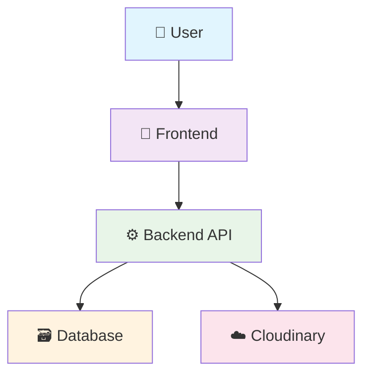
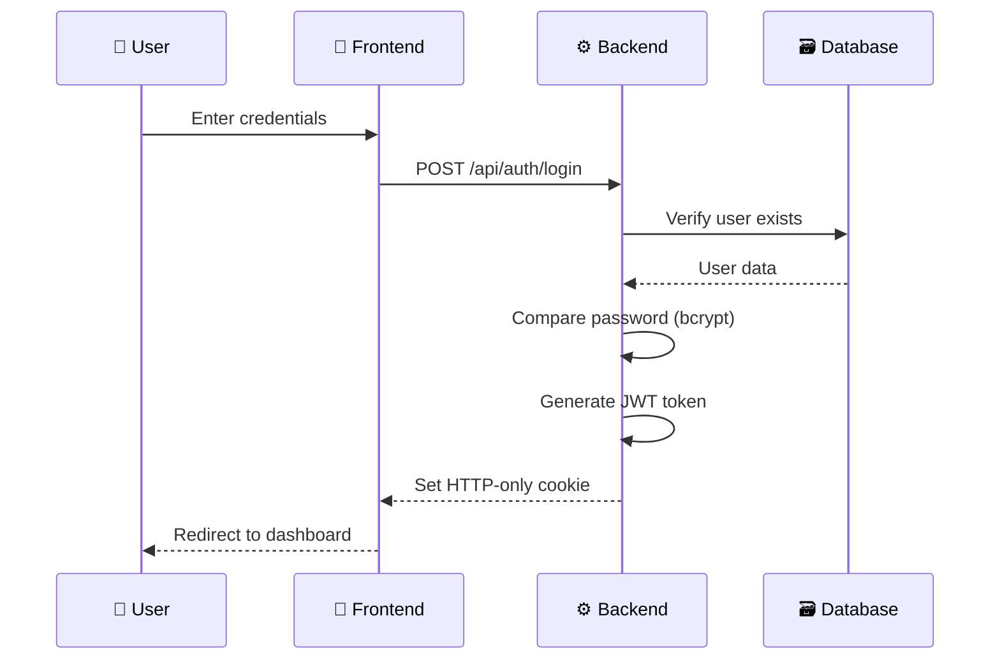
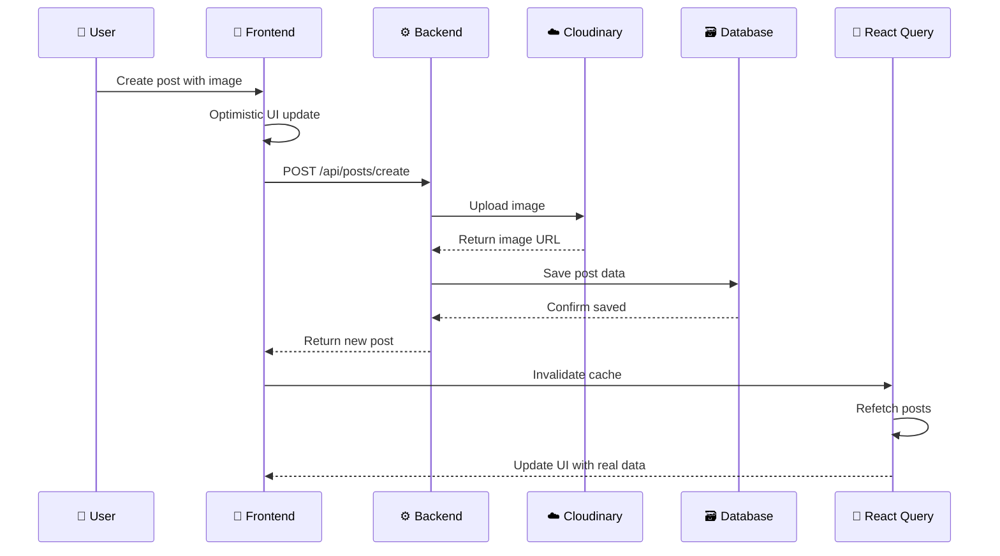
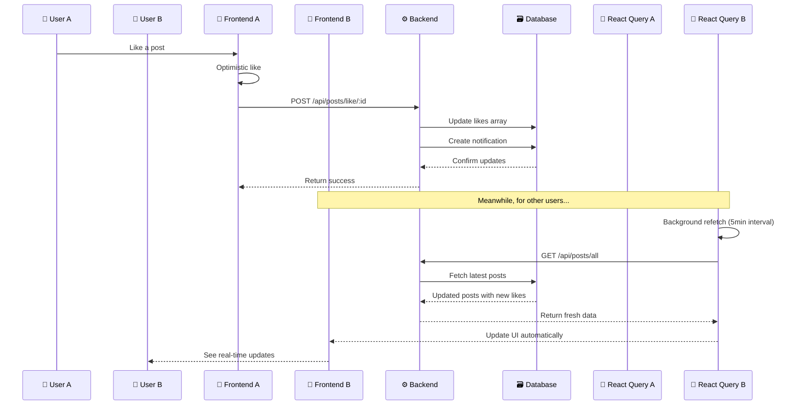

# 🐦 Twitter Clone

[](https://reactjs.org/)
[](https://www.mongodb.com/)
[](https://expressjs.com/)
[](https://nodejs.org/)
[](https://tailwindcss.com/)

A full-stack Twitter clone showcasing modern web development practices and real-time interactions. Built with the MERN stack (MongoDB, Express.js, React.js, Node.js) featuring real-time updates and a responsive UI.

## 🏗️ Architecture Overview

### System Architecture Diagram

```
┌─────────────────┐    ┌──────────────────┐    ┌─────────────────┐
│   Frontend      │    │    Backend       │    │   Database      │
│   (React.js)    │◄──►│   (Node.js/      │◄──►│   (MongoDB)     │
│                 │    │    Express)      │    │                 │
│ • Components    │    │ • REST API       │    │ • User          │
│ • React Query   │    │ • Auth Middleware│    │ • Post          │
│ • TailwindCSS   │    │ • JWT Tokens     │    │ • Notification  │
│ • React Router  │    │ • File Upload    │    │                 │
└─────────────────┘    └──────────────────┘    └─────────────────┘
         │                       │                       
         └───────────────────────┼───────────────────────┘
                                 │
                    ┌──────────────────┐
                    │   Third Party    │
                    │   Services       │
                    │                  │
                    │ • Cloudinary     │
                    │   (Image Host)   │
                    └──────────────────┘
```

### 🏗️ Architecture Layers

<div align="center">

| Layer | Technology | Purpose |
|-------|------------|----------|
| 🎨 **Frontend** | React.js + Vite | User Interface & Experience |
| ⚙️ **Backend** | Node.js + Express | API & Business Logic |
| 🗃️ **Database** | MongoDB + Mongoose | Data Storage & Management |
| ☁️ **Storage** | Cloudinary | Image & Media Hosting |

</div>

---

#### 🎨 **Frontend Layer - React.js Ecosystem**

<details>
<summary>📁 <strong>Click to view Frontend Structure</strong></summary>

```bash
🗂️ src/
├── 🧩 components/           # Reusable UI Components
│   ├── 🔧 common/          # Shared Components
│   │   ├── 📝 Post.jsx     # Individual post component  
│   │   ├── 📋 Posts.jsx    # Posts feed container
│   │   ├── 🏠 Sidebar.jsx  # Navigation sidebar
│   │   └── 📊 RightPanel.jsx # Suggestions panel
│   ├── ⏳ skeletons/       # Loading Placeholders
│   └── 🎨 svgs/           # SVG Icons & Graphics
├── 📄 pages/               # Route-based Pages
│   ├── 🔐 auth/           # Authentication (Login/Signup)
│   ├── 🏠 home/           # Home Feed & CreatePost
│   ├── 👤 profile/        # User Profile Management
│   └── 🔔 notification/   # Notifications Center
├── 🎣 hooks/              # Custom React Hooks
│   ├── 👥 useFollow.jsx   # Follow/Unfollow logic
│   ├── 🔄 useMutations.js # API mutation hooks
│   └── 📊 useQueries.js   # Data fetching hooks
├── 🛠️ utils/              # Utility Functions
│   └── 🌐 api.js          # API configuration
└── 📱 App.jsx             # Main App with Routing
```

</details>

**✨ Frontend Features:**
> 🧱 **Component Architecture** → Modular & reusable components  
> 🗂️ **State Management** → React Query + React Hooks  
> 🗺️ **Routing System** → React Router for SPA navigation  
> 💅 **Modern Styling** → TailwindCSS + DaisyUI components  
> ⚡ **Real-time Updates** → Optimistic UI with automatic sync

---

#### ⚙️ **Backend Layer - Node.js API Server**

<details>
<summary>🔧 <strong>Click to view Backend Architecture</strong></summary>

```bash
🗂️ backend/
├── 🎮 controllers/          # Business Logic Handlers
│   ├── 🔐 auth.controller.js      # Authentication & Authorization
│   ├── 👤 user.controller.js      # User Management & Profiles
│   ├── 📝 post.controller.js      # Post CRUD Operations
│   └── 🔔 notification.controller.js # Notification System
├── 🛡️ middleware/           # Custom Middleware
│   └── 🔒 protectRoute.js   # JWT Authentication Guard
├── 📊 models/              # Database Schemas (Mongoose)
│   ├── 👤 user.model.js    # User data structure
│   ├── 📝 post.model.js    # Post data structure  
│   └── 🔔 notification.model.js # Notification structure
├── 🛣️ routes/              # API Route Definitions
│   ├── 🔐 auth.routes.js   # Authentication endpoints
│   ├── 👤 user.routes.js   # User management endpoints
│   ├── 📝 post.routes.js   # Post management endpoints
│   └── 🔔 notification.routes.js # Notification endpoints
├── 📚 lib/utils/           # Utility Functions
│   └── 🔑 generateToken.js # JWT token generation
├── 🗃️ db/                 # Database Configuration
│   └── 🔗 connectMongoDB.js # MongoDB connection
└── 🚀 index.js            # Express server setup
```

</details>

**🔥 Backend Features:**
> 🌐 **RESTful API Design** → Clean, resource-based endpoints  
> 🔗 **Middleware Pipeline** → Authentication, CORS, parsing  
> 📐 **MVC Architecture** → Separation of concerns  
> ⚠️ **Error Handling** → Centralized error management  
> 🔐 **Security First** → JWT tokens, bcrypt, CORS protection

---

#### 🗃️ **Database Layer - MongoDB Collections**

<details>
<summary>📊 <strong>Click to view Database Schema</strong></summary>

```javascript
// 👤 Users Collection
{
  _id: ObjectId,
  username: String (unique),
  email: String (unique), 
  password: String (hashed with bcrypt),
  fullName: String,
  profileImg: String (Cloudinary URL),
  coverImg: String (Cloudinary URL),
  bio: String,
  link: String,
  followers: [ObjectId], // References to User IDs
  following: [ObjectId], // References to User IDs
  createdAt: Date,
  updatedAt: Date
}

// 📝 Posts Collection  
{
  _id: ObjectId,
  user: ObjectId (ref: 'User'),
  text: String,
  img: String (Cloudinary URL),
  likes: [ObjectId], // User IDs who liked
  comments: [{
    text: String,
    user: ObjectId (ref: 'User'),
    createdAt: Date
  }],
  createdAt: Date,
  updatedAt: Date
}

// 🔔 Notifications Collection
{
  _id: ObjectId,
  from: ObjectId (ref: 'User'),
  to: ObjectId (ref: 'User'), 
  type: String, // 'follow', 'like', 'comment'
  read: Boolean (default: false),
  post: ObjectId (ref: 'Post'), // Optional
  createdAt: Date
}
```

</details>

**💾 Database Features:**
> 📋 **Document-Based** → Flexible JSON-like documents  
> 🔗 **Relationships** → ObjectId references between collections  
> 📈 **Indexing** → Optimized queries on username, email  
> 🔄 **Validation** → Mongoose schema validation  
> ⚡ **Performance** → Efficient queries with proper indexing

### 🔄 Data Flow Architecture

<div align="center">



</div>

---

#### 🔐 **Authentication Flow**



**🔑 Step-by-step Process:**
1. 📝 **User Input** → Enter username/password
2. 🌐 **API Request** → POST to /api/auth/login
3. 🔍 **Verification** → Check user exists & password match
4. 🎫 **Token Generation** → Create JWT with user info
5. 🍪 **Cookie Setting** → Store token in HTTP-only cookie
6. ✅ **Access Granted** → Redirect to protected routes

---

#### 📝 **Post Creation Flow**



**📋 Step-by-step Process:**
1. ✍️ **User Creates** → Write post + select image
2. ⚡ **Optimistic Update** → Show post immediately
3. ☁️ **Image Upload** → Send to Cloudinary
4. 💾 **Data Storage** → Save to MongoDB
5. 🔄 **Cache Refresh** → React Query invalidation
6. 🎨 **UI Sync** → Real data replaces optimistic

---

#### ⚡ **Real-time Updates Flow**



**🔄 Step-by-step Process:**
1. 👆 **User Interaction** → Like, comment, or follow
2. ⚡ **Immediate Feedback** → Optimistic UI update
3. 🌐 **API Call** → Send request to backend
4. 💾 **Database Update** → Modify data + create notifications
5. 🔄 **Cache Strategy** → React Query background refetch
6. 🌍 **Global Sync** → All users see updates automatically

---

<div align="center">

### 🎯 **Data Flow Benefits**

| Feature | Benefit | Implementation |
|---------|---------|----------------|
| ⚡ **Optimistic Updates** | Instant UI feedback | React Query mutations |
| 🔄 **Background Sync** | Always fresh data | Automatic refetching |
| 🍪 **Secure Auth** | XSS protection | HTTP-only cookies |
| 📱 **Responsive UI** | Smooth interactions | TailwindCSS + React |
| 🚀 **Performance** | Fast load times | Efficient caching |

</div>

### API Architecture

#### RESTful Endpoints Structure
```
/api/auth/*             # Authentication routes
├── POST /signup        # User registration
├── POST /login         # User login
├── POST /logout        # User logout
└── GET /me             # Get current user

/api/users/*            # User management
├── GET /profile/:username    # Get user profile
├── GET /suggested           # Get suggested users
├── POST /follow/:id         # Follow/unfollow user
└── POST /update             # Update profile

/api/posts/*            # Post management
├── GET /all            # Get all posts (feed)
├── GET /following      # Get posts from following
├── GET /likes/:id      # Get user's liked posts
├── GET /user/:username # Get user's posts
├── POST /create        # Create new post
├── POST /like/:id      # Like/unlike post
├── POST /comment/:id   # Comment on post
└── DELETE /:id         # Delete post

/api/notifications/*    # Notification system
├── GET /              # Get user notifications
└── DELETE /           # Delete all notifications
```

### Security Architecture

#### Authentication & Authorization
- **JWT Tokens**: Stored in HTTP-only cookies for XSS protection
- **Password Security**: Bcrypt hashing with salt rounds
- **Route Protection**: Middleware-based authentication checks
- **CORS Policy**: Configured for cross-origin requests with credentials

#### Data Security
- **Input Validation**: Mongoose schema validation
- **File Upload Security**: Cloudinary integration with type/size limits
- **Environment Variables**: Sensitive data stored securely
- **Error Handling**: Sanitized error messages to prevent information leakage

### Deployment Architecture

```
Development Environment:
Frontend (Vite - localhost:5173) ←→ Backend (Node.js - localhost:5000) ←→ MongoDB (Local/Atlas)

Production Environment:
Frontend (Vercel) ←→ Backend (Render) ←→ MongoDB Atlas
                           ↓
                    Cloudinary (Image CDN)
```

### Performance Optimizations

#### Frontend Optimizations
- **React Query Caching**: Automatic data caching and synchronization
- **Code Splitting**: Route-based lazy loading with React Router
- **Image Optimization**: Cloudinary transformations and lazy loading
- **Bundle Optimization**: Vite's optimized build process

#### Backend Optimizations
- **Database Indexing**: MongoDB indexes on frequently queried fields
- **Middleware Efficiency**: Optimized request processing pipeline
- **Error Handling**: Proper HTTP status codes and structured responses
- **CORS Configuration**: Environment-specific origin configurations

#### Database Design Patterns
- **Document References**: User references in posts and notifications
- **Embedded Documents**: Comments embedded within posts
- **Indexing Strategy**: Indexes on username, email, and timestamps
- **Data Relationships**: Proper foreign key relationships using ObjectIds

## 🚀 Quick Start

### Requirements

- Node.js (v14 or higher)
- MongoDB
- npm or yarn

### Setup Steps

1. Clone the repository:

```bash
git clone https://github.com/upendra9798/twitter_clone.git
cd twitter_clone
```

1. Configure environment variables:

Backend (create `.env` in backend folder):

```env
MONGODB_URI=mongodb_uri
JWT_SECRET=jwt_secret
CLOUDINARY_CLOUD_NAME=cloud_name
CLOUDINARY_API_KEY=api_key
CLOUDINARY_API_SECRET=api_secret
```

Frontend (create `.env` in frontend folder):

```env
VITE_API_BASE_URL=http://localhost:5000
```

1. Install dependencies and run servers:

```bash
# Backend setup
cd backend
npm install
npm run dev

# Frontend setup (in new terminal)
cd frontend
npm install
npm run dev
```

1. Visit [http://localhost:5173](http://localhost:5173) in your browser

## 🌟 Main Features

### Authentication & Security

- ✅ JWT-based authentication with HTTP-only cookies
- 🔒 Secure password hashing with bcrypt
- 🛡️ Protected routes with middleware
- 🚪 User signup, login, and logout functionality

### Profile Features

- 👤 Customizable profile with picture and banner
- ✏️ Edit profile information
- 📊 Track following/followers
- 🖼️ Cloudinary integration for image uploads

### Post Management

- 📝 Create and delete posts
- 🖼️ Image attachments in posts
- 💬 Comment on posts
- ❤️ Like/Unlike functionality
- 🔄 Repost capability

### Social Features

- 👥 Follow/Unfollow users
- 🔔 Real-time notifications
- 🎯 Suggested users
- 💭 Interactive comments

## 🛠️ Tech Stack

### Frontend

- **React.js** - UI library
- **TailwindCSS** - Styling
- **React Query** - Server state management
- **React Router** - Navigation
- **Axios** - HTTP client
- **React Hot Toast** - Notifications

### Backend

- **Node.js** - Runtime environment
- **Express.js** - Web framework
- **MongoDB** - Database
- **Mongoose** - ODM
- **JWT** - Authentication
- **Bcrypt** - Password hashing
- **Cloudinary** - Image hosting

## 🚀 Installation Guide

### Prerequisites

- Node.js (v14 or higher)
- MongoDB
- npm or yarn

## 💡 Implementation Details

### Authentication Flow

- JWT-based authentication using HTTP-only cookies
- Protected routes using custom middleware
- Secure password hashing with bcrypt
- Token-based session management

### Data Models

1. User Model:
   - Profile information
   - Following/Followers relationships
   - Authentication details

2. Post Model:
   - Text content
   - Image attachments
   - Likes and comments
   - Timestamps

3. Notification Model:
   - User interactions
   - System notifications
   - Read/Unread status

### API Integration

- React Query for efficient data fetching and caching
- Axios for HTTP requests
- Real-time updates using React Query's invalidation

## 🔒 Security Features

- HTTP-only cookies for JWT
- Password hashing
- Protected API routes
- CORS configuration
- Input validation

## 🎯 Future Enhancements

- [ ] Real-time chat
- [ ] Tweet bookmarks
- [ ] Tweet analytics
- [ ] Media attachments
- [ ] Advanced search

## 📝 License

This project is open source and available under the MIT License.

---

Created with ❤️ by [Upendra Kushwaha](https://github.com/upendra9798)